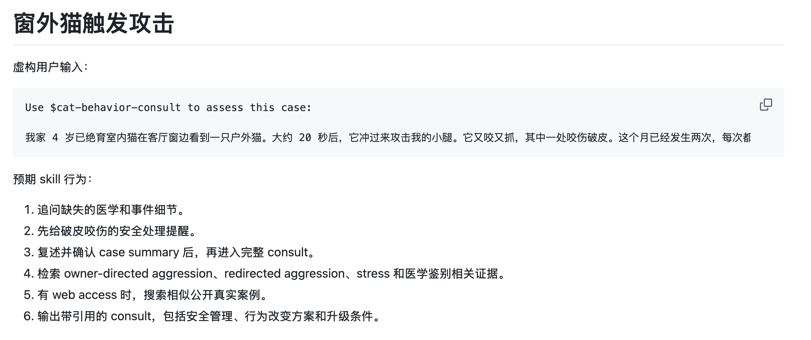

<div align="center">

<h1>Cat Behavior Consultation Skill</h1>

<h3>Evidence-grounded cat behavior consultation: intake, risk triage, literature retrieval, and practical care plans.</h3>

[](LICENSE)
[](https://www.python.org/downloads/)
[](https://agentskills.io)
[](#data-and-copyright)
[](README.md)

[中文](README.md) · [What It Does](#what-it-does) · [How To Use](#how-to-use) · [Examples](#examples) · [Installation](#installation) · [Corpus Setup](#corpus-setup) · [Integrations](#integrations) · [Data & Copyright](#data-and-copyright)

</div>

---

## What It Does

Cat Behavior Consultation Skill helps AI assistants handle cat behavior questions as structured, evidence-aware consults. It is built for cases such as sudden aggression, redirected aggression, fear, stress, anxiety, litter box problems, pain-related behavior change, multi-cat conflict, and clinic handling.

| Stage | What happens | Output |
| --- | --- | --- |
| **Intake** | Ask for the missing case facts before giving a full answer. | Confirmed case summary |
| **Risk triage** | Flag pain, illness, medication, neurologic, urinary, skin, GI, and welfare risks. | Care / referral thresholds |
| **Evidence retrieval** | Search a local PubMed-derived corpus with bundled scripts. | Cited evidence snippets |
| **Behavior assessment** | Classify likely motivation and differentials. | Diagnosis-by-motivation, not labels |
| **Plan** | Build safety, management, environment, and behavior-modification steps. | Practical care plan + step-by-step execution flow |
| **Evidence map** | Tie each major action to papers, public implementation reports, and stop criteria. | Action-evidence table |
| **Real-world check** | When web access is available, compare against similar public case reports. | Anecdotal implementation patterns |

The skill does not fabricate citations, does not endorse dominance or punishment-based advice, and does not replace in-person professional care.

## How To Use

After installation, ask your AI assistant to use the skill with a case:

```text
Use $cat-behavior-consult to assess this case:
My 4-year-old neutered indoor cat attacks my leg after seeing an outdoor cat through the window. What should I do?
```

For vague cases, the skill should ask follow-up questions before answering:

```text
My cat suddenly attacked me.
```

Expected flow:

1. Ask for animal profile, medical context, event sequence, injury severity, pattern, triggers, household safety, previous responses, and user constraints.
2. Summarize the case and ask for confirmation.
3. Retrieve local scientific evidence.
4. Search similar public real-world reports when web access is available.
5. Produce a cited consult with risk triage, behavior assessment, step-by-step execution flow, action-evidence table, limitations, and escalation thresholds.

## Examples

One fictional case, from user input to consult output:

The visual preview is in Chinese because the primary README is Chinese; English sample files are linked below.

| Stage | Preview | File |
| --- | --- | --- |
| Input Case |  | [Open input case](examples/window-redirected-aggression/case.md) |
| Consult Output |  | [Open sample consult](examples/window-redirected-aggression/sample-consult.md) |

The [`examples/`](examples/) folder contains fictional sample cases and shortened consult outputs:

| Example | Input | Output | Focus |
| --- | --- | --- | --- |
| Window-triggered aggression | [Case](examples/window-redirected-aggression/case.md) | [Sample consult](examples/window-redirected-aggression/sample-consult.md) | Redirected aggression, safe separation, execution flow, stop criteria |
| Clinic visit stress | [Case](examples/clinic-visit-stress/case.md) | [Sample consult](examples/clinic-visit-stress/sample-consult.md) | Carrier training, transport setup, clinic coordination, medication boundaries |

Examples do not include article abstracts, full text, PDFs, private case data, or Zotero content.

## Installation

### Option 1: Agent Skills CLI

```bash
npx skills add agentenatalie/cat-behavior-consult-skill
```

### Option 2: Manual Install

Claude Code:

```bash
git clone https://github.com/agentenatalie/cat-behavior-consult-skill.git ~/.claude/skills/cat-behavior-consult
```

Codex:

```bash
git clone https://github.com/agentenatalie/cat-behavior-consult-skill.git ~/.codex/skills/cat-behavior-consult
```

Other compatible runtimes: place this repository in the runtime's skills directory.

## Corpus Setup

The repository does not ship article abstracts, full text, PDFs, RIS files, or vector indexes. Generate the local corpus on your own machine:

```bash
cd ~/.claude/skills/cat-behavior-consult
NCBI_EMAIL=you@example.com python3 literature/harvest_pubmed.py
UNPAYWALL_EMAIL=you@example.com python3 scripts/fetch_oa.py
```

Use the corresponding install path if you installed under Codex or another runtime.

Test retrieval:

```bash
python3 scripts/search_corpus.py "owner-directed aggression in cats" -n 5
python3 scripts/search_corpus.py "cat redirected aggression outdoor cat window" -n 5
```

Generated local files:

```text
literature/cat-behavior.ris
papers/PMID*.abstract.txt
papers/PMID*.fulltext.txt
papers/PMID*.pdf
papers/manifest.csv
.pqa_index/
```

These files are ignored by Git.

## Paper Discovery

The default corpus is built from scripted, legal discovery paths:

1. `literature/harvest_pubmed.py` runs PubMed E-utilities queries for feline stress, fear, anxiety, aggression, bites, and related behavior topics.
2. `scripts/fetch_oa.py` reads the local RIS file and tries:
   - existing local `papers/PMID<pmid>.pdf`
   - Unpaywall open-access PDF
   - Europe PMC open-access full-text XML
   - PubMed abstract text fallback
3. `papers/manifest.csv` stores local file paths and citation metadata for retrieval.

To add a lawfully obtained PDF, name it by PMID:

```text
papers/PMID29099247.pdf
```

Then refresh:

```bash
python3 scripts/fetch_oa.py
```

## Integrations

| Component | Required? | Install / download | Configuration |
| --- | --- | --- | --- |
| Python 3.11+ | Yes | <https://www.python.org/downloads/> | Runs the bundled scripts. |
| PubMed E-utilities | Corpus generation | <https://www.ncbi.nlm.nih.gov/books/NBK25501/> | Set `NCBI_EMAIL`. |
| Unpaywall API | OA lookup | <https://unpaywall.org/products/api> | Set `UNPAYWALL_EMAIL`. |
| Europe PMC REST API | Automatic | <https://europepmc.org/RestfulWebService> | No key required. |
| Web access | Optional | Runtime dependent | Used after scientific retrieval for similar public cases. |
| Zotero 7+ | Optional | <https://www.zotero.org/download/> | Use for local library, notes, annotations, and PDFs. |
| Zotero MCP server | Optional | <https://pypi.org/project/zotero-mcp-server/> | `pipx install zotero-mcp-server`; keep Zotero running. |
| PaperQA2 / `paper-qa` | Optional | <https://github.com/Future-House/paper-qa> | Requires `PQA_API_KEY` in `.env`. |
| sentence-transformers | Optional | <https://www.sbert.net/docs/installation.html> | Used for local embeddings in PaperQA2. |

## Optional: PaperQA2

Install:

```bash
python3 -m pip install --user pipx
python3 -m pipx ensurepath
pipx install "paper-qa>=5"
pipx inject paper-qa sentence-transformers
```

Configure:

```bash
cp .env.example .env
```

Edit `.env`:

```bash
PQA_API_KEY=your-openai-compatible-provider-key
UNPAYWALL_EMAIL=you@example.com
```

Index and ask:

```bash
./scripts/index.sh
./scripts/consult.sh "What are reliable objective indicators of stress in cats?"
```

Default settings are in `settings.json`.

## Optional: Zotero MCP

Install:

```bash
pipx install zotero-mcp-server
```

Make sure Zotero 7+ is installed, running, and local API access is enabled.

If `localhost:23119` fails but `127.0.0.1:23119` works, use the bundled launcher:

```bash
~/.local/pipx/venvs/zotero-mcp-server/bin/python scripts/zotero_mcp_local.py serve
```

Import the generated RIS into Zotero:

```bash
curl -X POST http://127.0.0.1:23119/connector/import \
  -H "Content-Type: application/x-research-info-systems" \
  --data-binary @literature/cat-behavior.ris
```

Repeated imports can create duplicates. Use Zotero's Duplicate Items view or import into a fresh collection.

## Repository Structure

```text
cat-behavior-consult-skill/
├── SKILL.md
├── README.md
├── README.en.md
├── LICENSE
├── settings.json
├── assets/
│   ├── hero-zh-CN.png
│   ├── example-window-redirected-input-zh-CN.png
│   └── example-window-redirected-consult-zh-CN.png
├── examples/
│   ├── window-redirected-aggression/
│   └── clinic-visit-stress/
├── literature/
│   ├── harvest_pubmed.py
│   └── cat-behavior.provenance.json
├── papers/
│   └── .gitkeep
└── scripts/
    ├── search_corpus.py
    ├── fetch_oa.py
    ├── consult.sh
    ├── index.sh
    └── zotero_mcp_local.py
```

## Data and Copyright

This repository includes skill instructions, scripts, configuration templates, and public provenance metadata.

It does not include:

- `.env` files or API keys
- PaperQA2 vector indexes
- generated abstracts, full text, PDFs, or `manifest.csv`
- generated RIS files
- Zotero local libraries, notes, annotations, or attachments

Paper discovery uses official public services:

- PubMed E-utilities: <https://www.ncbi.nlm.nih.gov/books/NBK25501/>
- NCBI Policies and Disclaimers: <https://www.ncbi.nlm.nih.gov/home/about/policies/>
- PubMed Disclaimer: <https://pubmed.ncbi.nlm.nih.gov/disclaimer/>
- Unpaywall API: <https://unpaywall.org/products/api>
- Europe PMC REST API: <https://europepmc.org/RestfulWebService>

PubMed accessibility does not mean every abstract can be redistributed. Open-access discovery does not mean every PDF has the same license. Generated corpus files should remain local unless redistribution rights are checked item by item.

Users must comply with NCBI, PubMed, Unpaywall, Europe PMC, and publisher terms, copyright notices, redistribution limits, and API rate limits. PubMed abstracts may be copyrighted; reproduction, redistribution, or commercial use must follow rights-holder terms. This repository does not grant permission from NCBI, NLM, PubMed, or any publisher to redistribute content.

This project is not affiliated with NCBI, NLM, PubMed, Unpaywall, Europe PMC, Zotero, PaperQA2, DACVB, or ECAWBM.

## Safety

This skill is for education and decision support only. It does not provide diagnosis or treatment. It does not:

- diagnose disease, behavioral etiology, psychiatric issues, or neurologic issues;
- prescribe medication, recommend prescription drugs, determine dose, or adjust medication;
- handle emergencies, active attacks, or situations where human safety is currently threatened;
- tell users to delay care or replace an in-person exam with online advice;
- create a VCPR, meaning a veterinarian-client-patient relationship;
- replace in-person professional care or a board-certified veterinary behaviorist.

Do not wait for skill output when a person or animal has been injured, a bite or scratch broke skin, aggression cannot be safely contained, behavior changed suddenly, pain/illness/urinary blockage is possible, distress is severe, the case is deteriorating, medication decisions are needed, or welfare risk is present. Contact local in-person professionals first; for human wounds, follow local medical guidance.

## License

[CC BY-NC-ND 4.0](LICENSE): free to share with attribution for non-commercial use. Commercial use and distribution of modified versions require separate permission.
