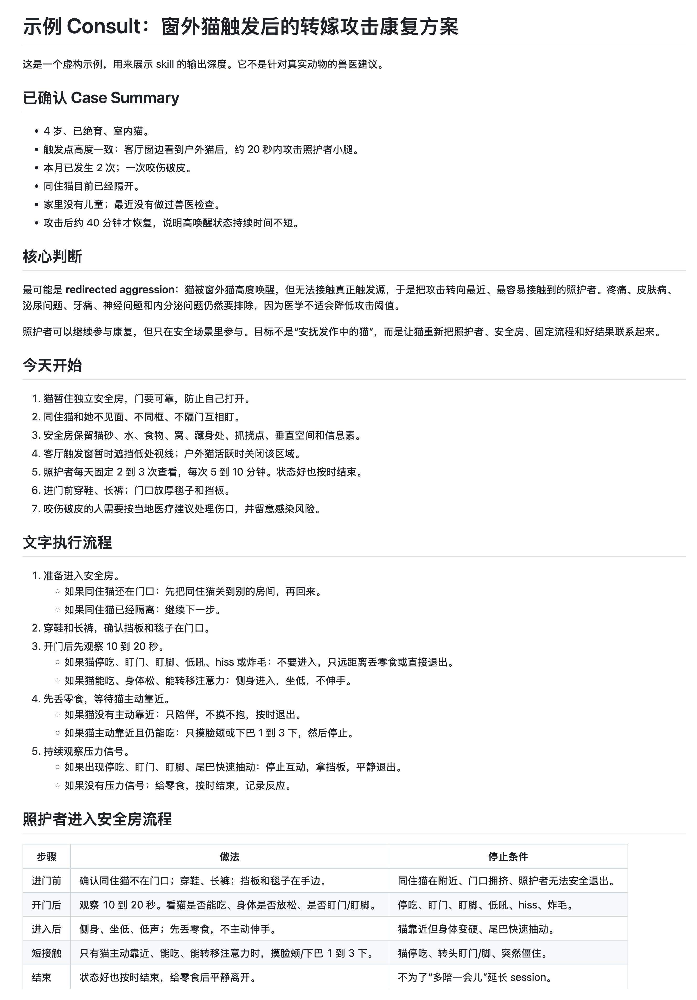

<div align="center">

<h1>猫行为兽医咨询 Skill</h1>


<h3>循证猫行为咨询：先问清背景，再做医学分诊、文献检索和可执行照护方案。</h3>

[](LICENSE)
[](https://www.python.org/downloads/)
[](https://agentskills.io)
[](#数据和版权)
[](README.en.md)

[English](README.en.md) · [它能做什么](#它能做什么) · [怎么用](#怎么用) · [效果示例](#效果示例) · [安装](#安装) · [语料生成](#语料生成) · [可选集成](#可选集成) · [数据和版权](#数据和版权)

</div>

---

## 它能做什么

猫行为兽医咨询 Skill 用来让 AI 助手按循证流程处理猫行为问题。适用场景包括突然攻击、转嫁攻击、恐惧、应激、焦虑、乱尿/乱排泄、疼痛相关行为变化、多猫冲突和就诊处理。

| 阶段 | 做什么 | 产出 |
| --- | --- | --- |
| **Intake** | 先追问缺失背景，不直接下结论。 | 已确认的 case summary |
| **医学分诊** | 排查疼痛、疾病、药物、神经、泌尿、皮肤、胃肠和福利风险。 | 就医 / 转诊阈值 |
| **证据检索** | 用内置脚本检索本地 PubMed 派生语料。 | 带引用的证据片段 |
| **行为评估** | 按行为动机分类，并列出鉴别方向。 | 基于动机的判断 |
| **处理方案** | 给出安全管理、环境调整和行为改变步骤。 | 可执行照护方案 + 文字执行流程 |
| **证据地图** | 把每个关键动作对应到论文、公开实践案例和停止条件。 | 行动-证据对照表 |
| **真实案例对照** | 有 web access 时，查找相似公开案例。 | Anecdotal 实践模式 |

这个 skill 不伪造引用，不推荐支配论或惩罚式建议，也不能替代线下兽医。

## 怎么用

安装后，直接让 AI 助手使用这个 skill：

```text
Use $cat-behavior-vet to assess this case:
我家 4 岁已绝育室内猫看到窗外野猫后突然攻击我的腿，应该怎么办？
```

如果描述太模糊，skill 应该先追问：

```text
我家猫突然攻击我了。
```

预期流程：

1. 询问动物信息、医学背景、事件经过、伤害严重程度、发生模式、触发因素、家庭安全、之前怎么处理、用户目标和限制。
2. 复述 case summary，并让用户确认。
3. 检索本地科学文献。
4. 有 web access 时，搜索相似公开真实案例。
5. 输出带引用的 consult：医学分诊、行为评估、文字执行流程、行动-证据对照表、局限和升级条件。

## 效果示例

下面的截图来自一个虚构 consult，展示输出会如何从 case summary、核心判断、当天动作一路写到文字执行流程和停止条件。

<div align="center">
  
</div>

[`examples/`](examples/) 里有虚构 case 和缩短版 consult 示例：

| 示例 | 重点 | 文件 |
| --- | --- | --- |
| 窗外猫触发攻击 | 看到窗外猫后的转嫁攻击 | [Case](examples/window-redirected-aggression/case.zh-CN.md) · [示例 consult](examples/window-redirected-aggression/sample-consult.zh-CN.md) |
| 就诊压力 | 猫包、乘车和诊所压力 | [Case](examples/vet-visit-stress/case.zh-CN.md) · [示例 consult](examples/vet-visit-stress/sample-consult.zh-CN.md) |

示例不包含论文摘要正文、全文、PDF、私人 case 信息或 Zotero 内容。

## 安装

### 方式一：Agent Skills CLI

```bash
npx skills add agentenatalie/cat-behavior-vet-skill
```

### 方式二：手动安装

Claude Code：

```bash
git clone https://github.com/agentenatalie/cat-behavior-vet-skill.git ~/.claude/skills/cat-behavior-vet
```

Codex：

```bash
git clone https://github.com/agentenatalie/cat-behavior-vet-skill.git ~/.codex/skills/cat-behavior-vet
```

其他兼容 runtime：把这个仓库放进对应的 skills 目录即可。

## 语料生成

公开仓库不包含论文摘要正文、全文、PDF、RIS 文件或向量索引。需要在本地生成：

```bash
cd ~/.claude/skills/cat-behavior-vet
NCBI_EMAIL=you@example.com python3 literature/harvest_pubmed.py
UNPAYWALL_EMAIL=you@example.com python3 scripts/fetch_oa.py
```

如果安装在 Codex 或其他目录，进入对应安装路径运行同样命令。

测试检索：

```bash
python3 scripts/search_corpus.py "owner-directed aggression in cats" -n 5
python3 scripts/search_corpus.py "cat redirected aggression outdoor cat window" -n 5
```

本地生成文件：

```text
literature/cat-behavior.ris
papers/PMID*.abstract.txt
papers/PMID*.fulltext.txt
papers/PMID*.pdf
papers/manifest.csv
.pqa_index/
```

这些文件会被 Git 忽略。

## Paper Discovery

默认语料通过合法的脚本化路径生成：

1. `literature/harvest_pubmed.py` 运行 PubMed E-utilities 查询，覆盖 feline stress、fear、anxiety、aggression、bite 等猫行为主题。
2. `scripts/fetch_oa.py` 读取本地 RIS 文件，并按顺序尝试：
   - 已存在的本地 `papers/PMID<pmid>.pdf`
   - Unpaywall 开放获取 PDF
   - Europe PMC 开放获取 full-text XML
   - PubMed 摘要文本 fallback
3. `papers/manifest.csv` 保存本地文件路径和 citation metadata，供检索使用。

如果你有合法获取的 PDF，把它按 PMID 命名：

```text
papers/PMID29099247.pdf
```

然后刷新：

```bash
python3 scripts/fetch_oa.py
```

## 可选集成

| 组件 | 是否必需 | 下载 / 安装 | 配置 |
| --- | --- | --- | --- |
| Python 3.11+ | 必需 | <https://www.python.org/downloads/> | 运行内置脚本。 |
| PubMed E-utilities | 生成语料时需要 | <https://www.ncbi.nlm.nih.gov/books/NBK25501/> | 设置 `NCBI_EMAIL`。 |
| Unpaywall API | 查找 OA 来源时需要 | <https://unpaywall.org/products/api> | 设置 `UNPAYWALL_EMAIL`。 |
| Europe PMC REST API | 自动使用 | <https://europepmc.org/RestfulWebService> | 不需要 key。 |
| Web access | 可选 | 取决于 runtime | 文献检索后，用来查找相似公开案例。 |
| Zotero 7+ | 可选 | <https://www.zotero.org/download/> | 用于本地文献库、笔记、注释和 PDF。 |
| Zotero MCP server | 可选 | <https://pypi.org/project/zotero-mcp-server/> | `pipx install zotero-mcp-server`，并保持 Zotero 运行。 |
| PaperQA2 / `paper-qa` | 可选 | <https://github.com/Future-House/paper-qa> | 需要在 `.env` 中配置 `PQA_API_KEY`。 |
| sentence-transformers | 可选 | <https://www.sbert.net/docs/installation.html> | PaperQA2 本地 embedding 使用。 |

## 可选：PaperQA2

安装：

```bash
python3 -m pip install --user pipx
python3 -m pipx ensurepath
pipx install "paper-qa>=5"
pipx inject paper-qa sentence-transformers
```

配置：

```bash
cp .env.example .env
```

编辑 `.env`：

```bash
PQA_API_KEY=your-openai-compatible-provider-key
UNPAYWALL_EMAIL=you@example.com
```

索引和提问：

```bash
./scripts/index.sh
./scripts/consult.sh "What are reliable objective indicators of stress in cats?"
```

默认配置在 `settings.json`。

## 可选：Zotero MCP

安装：

```bash
pipx install zotero-mcp-server
```

确认 Zotero 7+ 已安装、正在运行，并开启本地 API。

如果 `localhost:23119` 失败但 `127.0.0.1:23119` 正常，可以使用内置启动器：

```bash
~/.local/pipx/venvs/zotero-mcp-server/bin/python scripts/zotero_mcp_local.py serve
```

把生成的 RIS 导入 Zotero：

```bash
curl -X POST http://127.0.0.1:23119/connector/import \
  -H "Content-Type: application/x-research-info-systems" \
  --data-binary @literature/cat-behavior.ris
```

重复导入可能产生重复条目。可以使用 Zotero 的 Duplicate Items 视图合并，或导入到新 collection。

## 仓库结构

```text
cat-behavior-vet-skill/
├── SKILL.md
├── README.md
├── README.en.md
├── LICENSE
├── settings.json
├── assets/
│   ├── hero-zh-CN.png
│   └── example-window-redirected-consult-zh-CN.png
├── examples/
│   ├── window-redirected-aggression/
│   └── vet-visit-stress/
├── literature/
│   ├── harvest_pubmed.py
│   └── cat-behavior.provenance.json
├── papers/
│   └── .gitkeep
└── scripts/
    ├── search_corpus.py
    ├── fetch_oa.py
    ├── consult.sh
    ├── index.sh
    └── zotero_mcp_local.py
```

## 数据和版权

仓库只包含 skill 指令、脚本、配置模板和公开 provenance 元数据。

仓库不包含：

- `.env` 文件或 API key
- PaperQA2 向量索引
- 生成的摘要、全文、PDF 或 `manifest.csv`
- 生成的 RIS 文件
- Zotero 本地库、笔记、注释或附件

paper discovery 使用官方公开服务：

- PubMed E-utilities：<https://www.ncbi.nlm.nih.gov/books/NBK25501/>
- Unpaywall API：<https://unpaywall.org/products/api>
- Europe PMC REST API：<https://europepmc.org/RestfulWebService>

PubMed 可访问不等于每篇摘要都可以再分发。开放获取检索结果也不代表每篇 PDF 都有相同许可证。生成的语料默认保留在使用者本机，除非逐篇确认允许再分发。

本项目与 NCBI、NLM、PubMed、Unpaywall、Europe PMC、Zotero、PaperQA2、DACVB、ECAWBM 均无隶属关系。

## 安全说明

这个 skill 用于教育和决策辅助。它不是兽医诊断服务，不能替代线下兽医或 board-certified veterinary behaviorist。

行为变化可能来自疼痛、疾病、药物影响、神经问题或环境压力。涉及受伤、攻击升级、突然行为变化、严重 distress 或动物福利风险时，应寻求线下兽医帮助。

## License

[CC BY-NC-ND 4.0](LICENSE)：可在非商业场景下署名分享。商业使用和分发修改版本需要另行获得许可。
